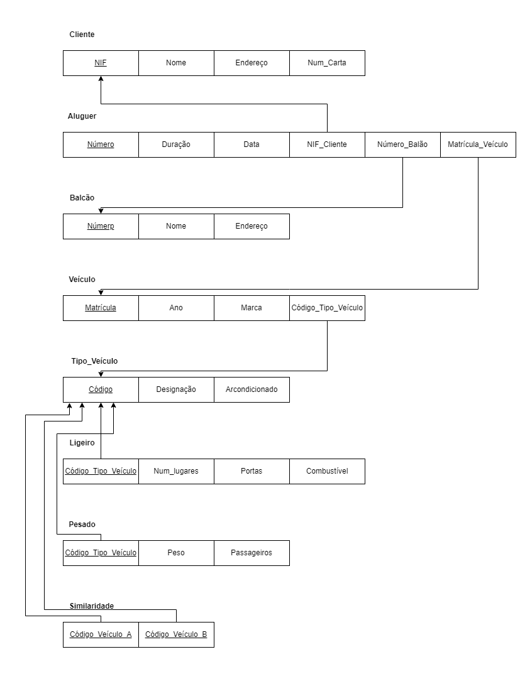
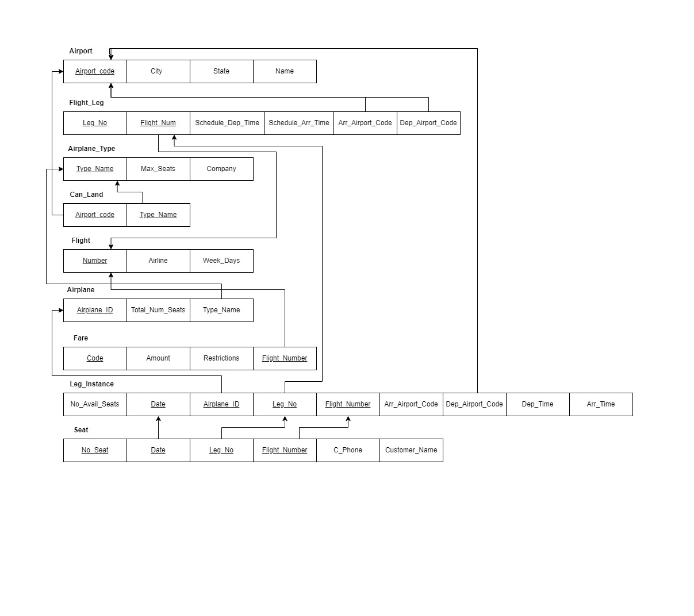
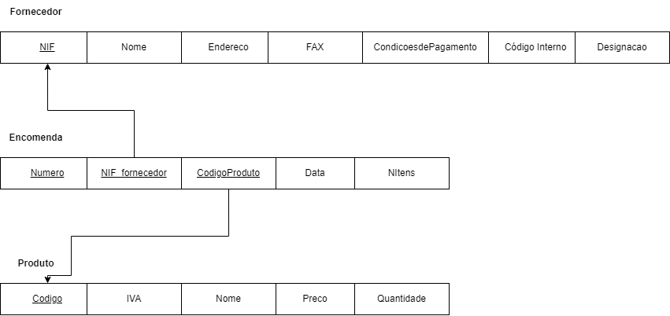
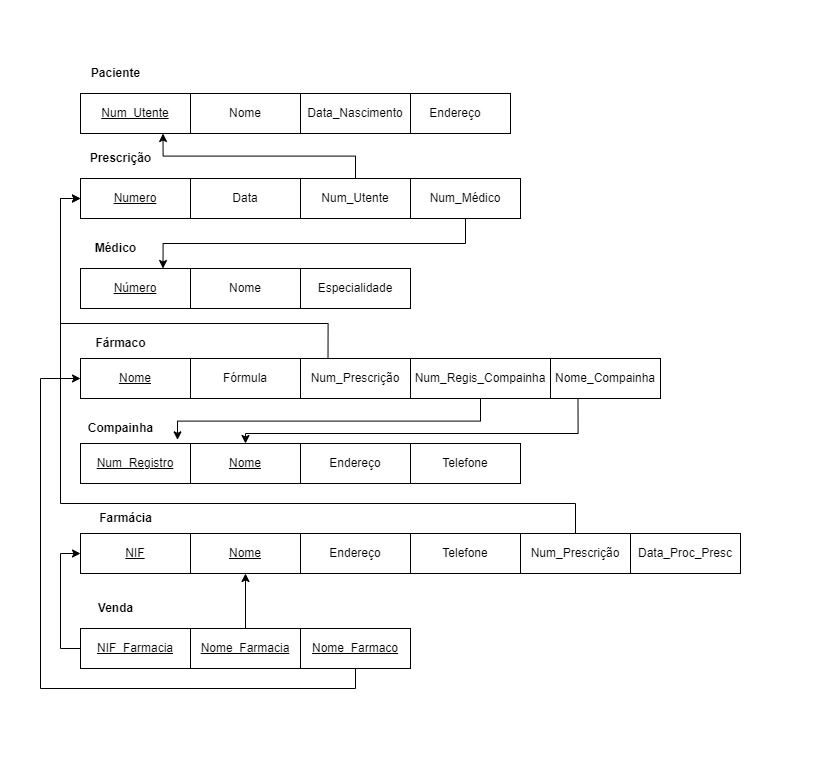
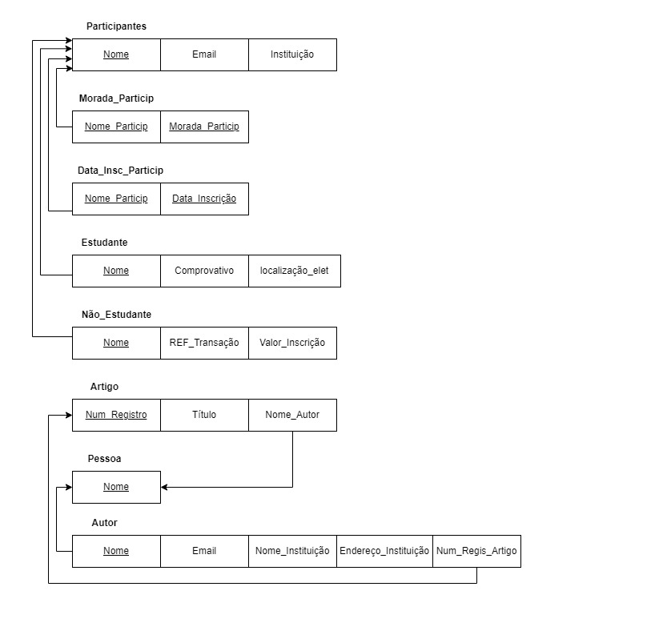
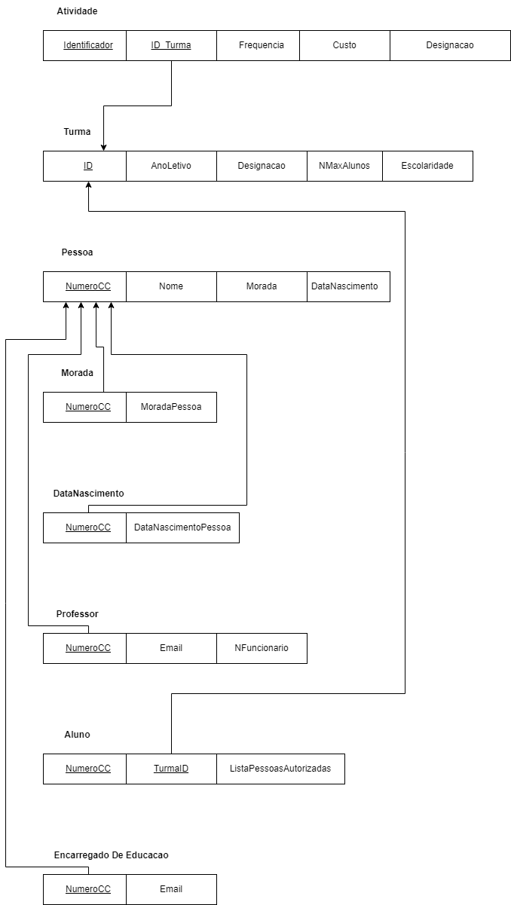

# BD: Guião 3


## ​Problema 3.1
 
### *a)*

```
Cliente(NIF, Nome, Endereço, Num_Carta)

Aluguer(Número, Duração, Data, NIF_Cliente, Número_Balcão, Matrícula_Veículo)

Balcão(Número, Nome, Endereço)

Veículo(Matrícula, Ano, Marca, Código_Tipo_Veículo)

TipoVeículo(Código, Designação, Arcondicionado)

Ligeiro(Código_Veículo, Num_Lugares, Portas, Combustível)

Pesado(Código_Veículo, Peso, Passageiros)

Similaridade(Código_Veúculo_A, Código_Veúculo_B)
```


### *b)* 

```
Cliente:
Primárias: NIF
Candidatas: Nome, Num_Carta, NIF
Estrangeiras: Não tem

Aluguer:
Primárias: Número
Candidatas: Número
Estrangeiras:  NIF_Cliente, Número_Balcão, Matrícula_Veículo

Balcão:
Primárias: Número
Candidatas: Nome, Número
Estrangeiras: Não tem

Veículo:
Primárias: Matrícula
Candidatas: Matrícula
Estrangeiras: Código_Tipo_Veículo

Tipo_Veículo:
Primárias: Código
Candidatas: Código
Estrangeiras: Não tem

Ligeiro:
Primárias: Código_Tipo_Veículo
Candidatas: Código_Tipo_Veículo
Estrangeiras: Código_Tipo_Veículo

Pesado:
Primárias: Código_Tipo_Veículo
Candidatas: Código_Tipo_Veículo
Estrangeiras: Código_Tipo_Veículo

Similaridade:
Primárias: Código_Veículo_A, Código_Veículo_B
Estrangeiras: Código_Veículo_A, Código_Veículo_B
```


### *c)* 




## ​Problema 3.2

### *a)*

```
Airport(AirportCode, City, State, Name)

FlightLeg(LegNo, FlightNumber, ScheduleDepTime, ScheduleArrTime, AirportCodeDep, AirportCodeArr)

AirplaneType(TypeName, MaxSeats, Company)

Flight(Number, AirLine, Weekdays)

Airplane(AirplaneId, TotalNSeats, TypeName)

Fare(Code, NumberFlight, Amount, Restrictions)

LegInstance(Date, LegNo, FlightNumber, N_ofAvailSeats, AirportCodeArr, AirportCodeDep, ArrTime, DepTime, AirplaneId)

Seat(NSeat, Date, LegNo, FlightNumber, CPhone, CustomerName)

CanLand(AirportCode, TypeName)
```


### *b)* 

```
Airport:
Primárias: AirportCode
Candidatas: Name, AirportCode
Estrangeiras: Não tem

FlightLeg:
Primárias: LegNo, FlightNumber
Candidatas: LegNo
Estrangeiras: FlightNumber, AirportCodeDep, AirportCodeArr

AirplaneType:
Primárias: TypeName
Candidatas: TypeName
Estrangeiras:  Não tem

Flight:
Primárias: Number
Candidatas: Number
Estrangeiras: Não tem

Airplane:
Primárias: AirplaneId
Candidatas: AirplaneId
Estrangeiras: TypeName

Fare:
Primárias: Code, FlightNumber
Candidatas: Code
Estrangeiras: FlightNumber

LegInstance:
Primárias: Date, LegNo, FlightNumber
Candidatas: Date
Estrangeiras: LegNo, FlightNumber, AirportCodeArr, AirportCodeDep, AirplaneId

Seat:
Primárias: NSeat, Date, LegNo, FlightNumber
Candidatas: NSeat
Estrangeiras: Date, LegNo, FlightNumber, 

CanLand:
Primária: AirPortCode,, TypeName
Estrangeiras: AirPortCode, TypeName
```


### *c)* 




## ​Problema 3.3


### *a)* 2.1



### *b)* 2.2



### *c)* 2.3



### *d)* 2.4

