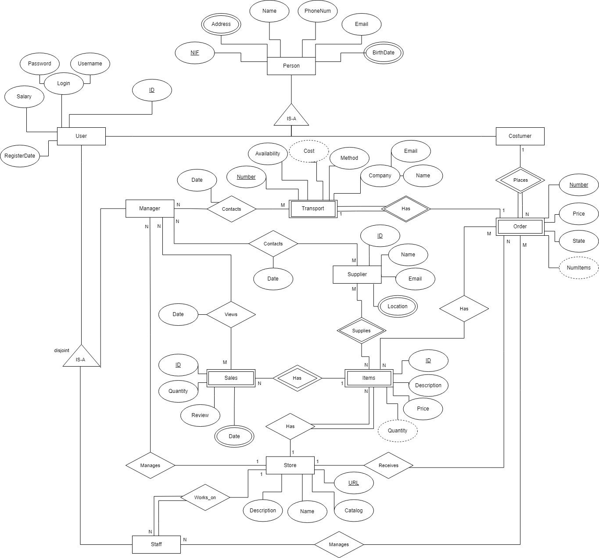
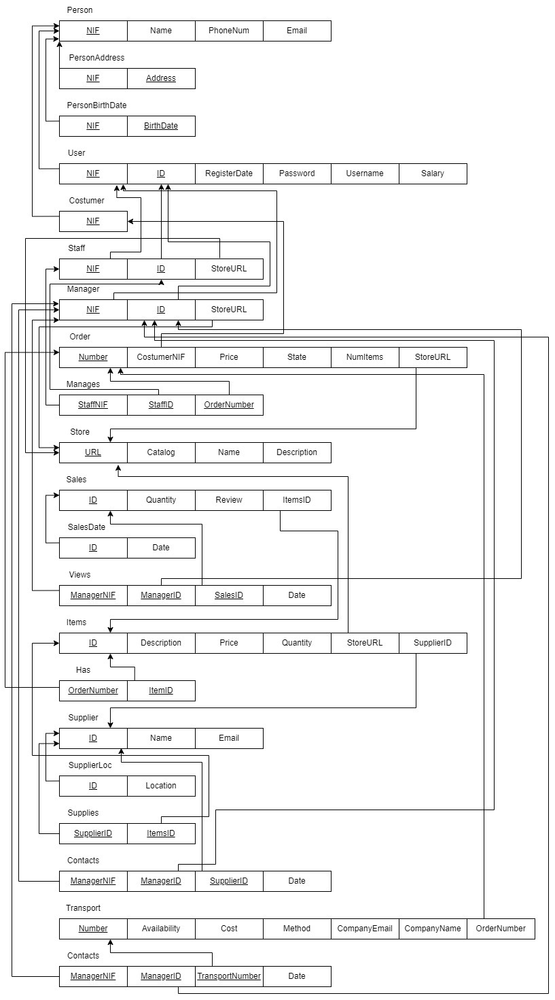

# BD: Trabalho Prático APFE

**Grupo**: P5G4
- Bernardo Pinto, MEC: 105926
- José Mendes, MEC: 107188

## Introdução / Introduction
 
O tema escolhido pelo grupo consiste na criação de uma Base de Dados para uma plataforma de criação e gestão de lojas pessoais. Para tal, o usuário, que pode ser um gerente ou um funcionário, necessita de visualizar dados que lhes permitam obter informação da venda dos seus produtos, bem como permitir a comunicação com fornecedores e transportadoras.

## ​Análise de Requisitos / Requirements

O foco desta base de dados consiste na implementação de plataforma de gerenciamento de lojas online por parte do utilizador. Estes podem realizar tarefas como, criar a sua loja online, visualizar vendas, colocar novos produtos disponíveis, alterar preços de produtos existentes, gerir pedidos, entre outros. Para tal, colocamo-nos na posição de clientes deste sistema, e realizamos uma análise de requisitos com base nas observações adquiridas.
Inicialmente, percebemos que seria melhor utilizar uma entidade genérica Person, que se subdivide em duas outras entidades, User e Costumer, que herdam os atributos desta entidade.

Atributos de Person:

•	NIF, chave primária

•	Address, atributo multivalor

•	Name

•	PhoneNum

•	Email

•	BirthDate, atributo multivalor

A entidade Costumer, representa as pessoas que realizam pedidos na loja, pelo que não representa um utilizador direto da plataforma. No entanto é de extrema relevância manter as informações destes para tornar mais fácil a compra de produtos (por exemplo, caso algum pedido não corra como desejado é necessário informar o cliente). 

Por sua vez, a entidade User terá as informações necessárias para aceder à plataforma, possuindo assim os seguintes atributos:

•	ID, chave primária

•	Login, atributo composto por Username e Password

•	Salary

•	RegisterDate

Ainda no User, este também será uma entidade genérica para duas entidades, Staff e Manager, em que a primeira representa os funcionários desta loja, possuindo ainda autorizações mais restritas quando comparado com o Manager. As suas tarefas incluem visualizar e gerenciar os pedidos; gerenciar stock e itens. 

Por sua vez o Manager, representa as pessoas que têm total permissão de gerenciamento da loja. Algumas das duas permissões baseiam-se em contratar novos funcionários, alterar a disponibilidade da loja, visualizar a disponibilidade das transportadoras, contactar fornecedores, entre outros.

Adicionamos a entidade Store que será então a entidade central deste sistema, representando a loja em si. Esta é administrada pela entidade Manager e possuí vários funcionários, que como visto antes são representados pela entidade Staff.

Atributos de Store:

•	URL, chave primária

•	Name

•	Catalog

•	Description

A loja possui produtos que estão disponíveis para compra na mesma. Estes estão representados pela entidade Items, que possui como atributos:

•	ID, chave primária

•	Price

•	Quantity, atributo derivado

•	Description

Posteriormente, percebemos que os produtos necessitam de fornecedores. Cada um destes pode fornecer vários produtos distintos, e diferentes fornecedores podem fornecer o mesmo produto. Estes são representados pela entidade Supplier, que possui os atributos:

•	ID, chave primária

•	Name

•	Email

•	Location, atributo multivalor

Consequentemente, estes produtos são vendidos a clientes. Para tal, os mesmos necessitam de realizar pedidos na loja que acabam por ser, então, representados pela entidade Order, com os atributos:

•	Number, chave primária

•	Price

•	State

•	NumItems, atributo derivado

Além disso, criamos uma entidade Transport, que representa a forma como um determinado pedido vai ser transportado para o cliente destino.

Atributos de Transport:
•	Number, chave primária

•	Availability

•	Method

•	Cost, atributo derivado

•	Company, atributo composto por Email e Name

Por fim, foi criada a entidade Sales, que representa as vendas que a loja fez. Cada produto pode ter várias vendas ao longo do tempo e é importante guardar cada um dos pedidos para que os gerentes da loja consigam ver os produtos mais vendidos. Os atributos desta entidade são:

•	ID, chave primária

•	Quantity

•	Review

•	Date, atributo multivalor

Em suma, uma loja, Store, pode possuir vários gerentes, Manager, e vários funcionários, Staff, cada um destes possui uma função diferente na loja, pelo que possuem diferentes permissões.  A loja possui produtos, Item, que são disponibilizados por fornecedores, Supplier. Por sua vez, os produtos são vendidos a clientes, Costumer, que, para tal, realizam pedidos, Order, na loja online. Estes pedidos necessitam de algum tipo de transporte, Transport, para que possam ser entregues aos clientes destino. Finalmente, para gerir melhor o stock e saber quais os produtos com mais procura, é necessário guardar informações sobre cada uma das compras realizadas, Sales.

## DER

## ER

